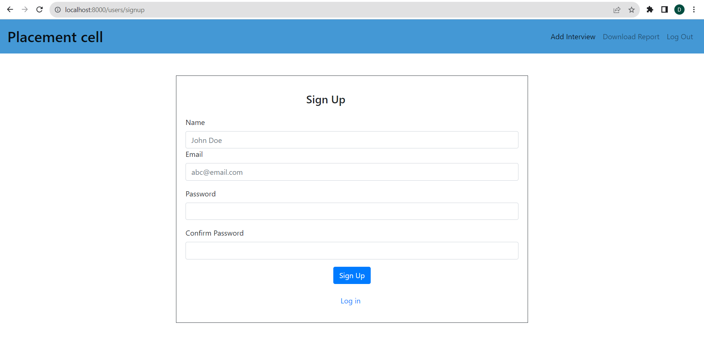
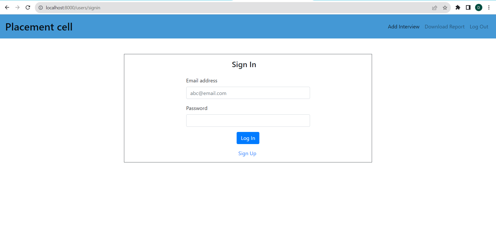
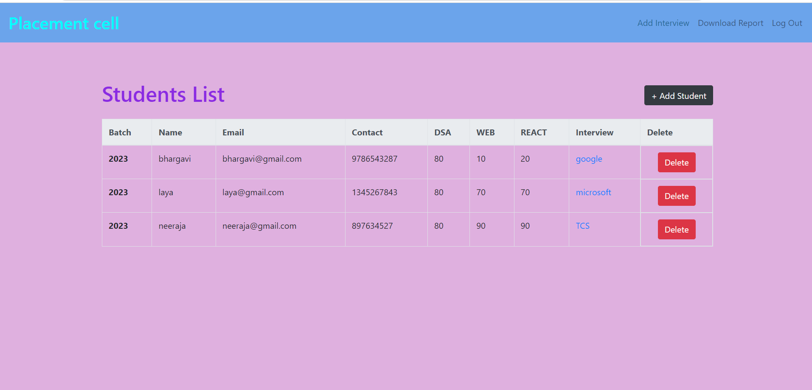
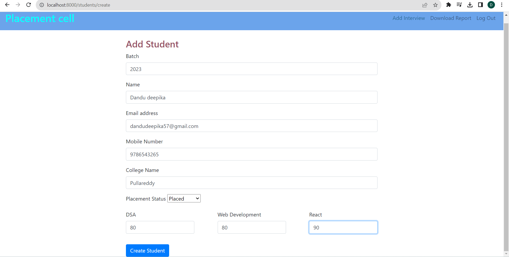
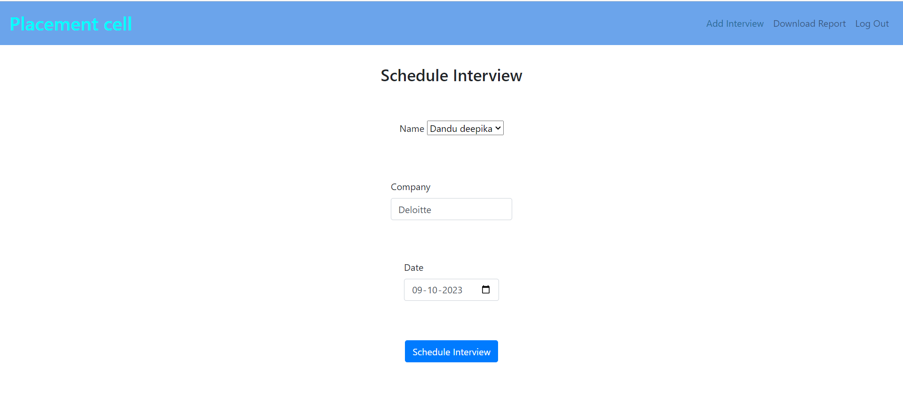

# Placement Cell

### An interface for coding ninjas placement cell to keep records of students and schedule interviews with different companies

## FEATURES

.Sign up / Sign in forms for employees
.Add a new student to the list of students
.Allocate and schedule interview with different companies and update their result status
.Download reports of students in csv format

## TECH STACK:

.Node.js: An asynchronous event-driven JavaScript runtime, Node.js is designed to build scalable network applications.

.Express: Express is a minimal and flexible Node.js web application framework

.EJS: View Engine used to display web pages

.mongoDB: A NoSQL database which uses JSON-like documents

.Passport: Passport is authentication middleware for Node.js

## SCREENSHOTS:

### Sign Up

### Sign In

### Home

### Add Student

### Allocate

## Setup

Run npm install to install required dependencies Create .env file in config directory Environment Variables:

PORT = [Your Port]
MONGO_URL = [Your MongoDB Url]
